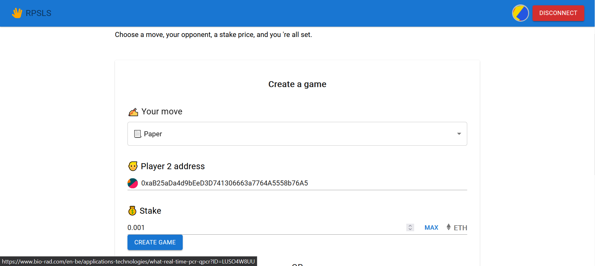
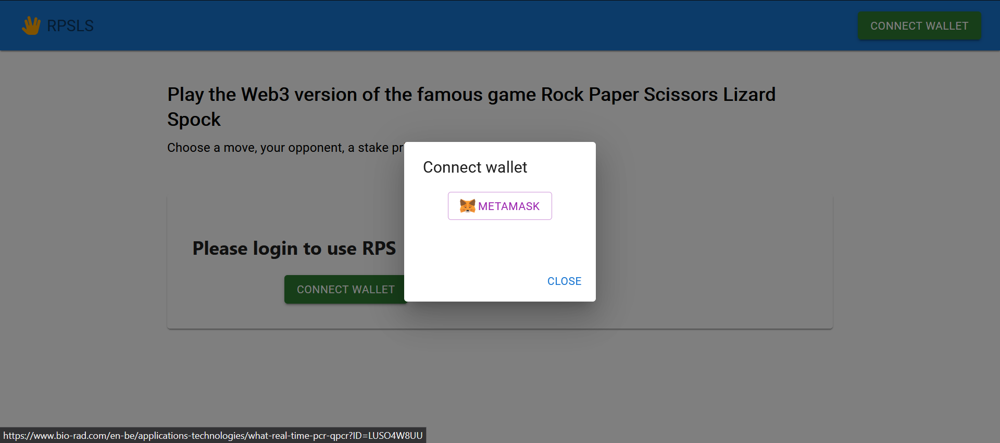

# Rock Paper Scissors Lizard Spock - Web3 Edition

## Overview
Rock Paper Scissors Lizard Spock is an extended version of the classic game, now enhanced with web3 technology. This Ethereum-based game allows players to challenge each other using ETH as a stake. With its simple and secure gameplay, it offers an exciting way to engage with blockchain technology.

## How to Play
1. **Creating a Game**: A player initiates the game, sets their move in a secure manner, selects an opponent, and stakes ETH.
2. **Joining a Game**: The challenged player then matches the stake and chooses their move.
3. **Revealing Moves**: The game concludes with the initiator revealing their move. The smart contract then distributes the ETH to the winner or splits it in a tie.

## Features
- Simple and intuitive web3 interface.
- Secure commitment scheme to ensure fair play.
- Timed responses to avoid indefinite waiting.

## Tech Stack
- [React](https://reactjs.org/)
- [TypeScript](https://www.typescriptlang.org/)
- [Material UI](https://mui.com/material-ui/getting-started/)
- [Styled Components](https://www.npmjs.com/package/styled-components)
- [Ethers.js](https://docs.ethers.org/v5/getting-started/)
- [React-toastify](https://www.npmjs.com/package/react-toastify)

## Getting Started
1. **Prerequisites**: Ensure you have MetaMask installed and configured for the Ethereum testnet (specific testnet details here).
2. **Installation**: 

Clone the repos, in the project directory, you can run:

`npm i`

`npm start`

3. **Playing the Game**: 

- connect to metamask
- choose your move
- select an opponent
- stake ETH

 
 

## Limitations
- Supports only 2 players at a time.
- Optimized for Firefox browser.
- Not optimized for mobile.

## Testing
- [URL](https://main--web3rps.netlify.app/) for testing the deployed version of the game.
